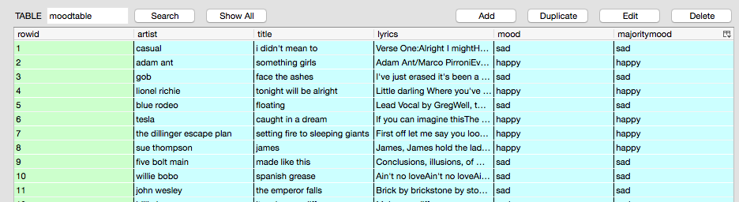
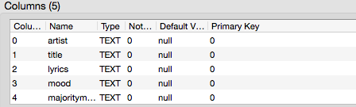

# MusicMood

### A machine learning approach to classify music by mood based on song lyrics.

This directory contains the code for the web app. Please note that I don't include the mandatory `all_data.sqlite` database file, which contains the lyics, to avoid potential copyright conflicts.

However, below is at least an overview of the database schema:

Sebastian Raschka, 2014